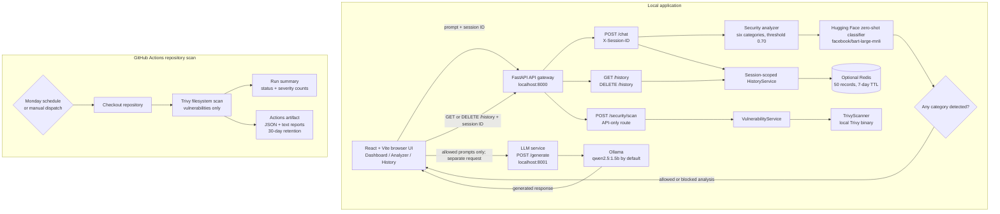

# SecureLLM

SecureLLM is an open-source prompt security gateway for LLM applications. It analyzes prompts before they reach an optional local language model and returns category-level findings, confidence scores, and an allow-or-block decision.

[](LICENSE)

## Current Capabilities

- React and Vite interface for submitting prompts and reviewing analysis.
- FastAPI gateway with prompt-injection, jailbreak, sensitive-information, system-prompt-leakage, toxicity, and malicious-intent detectors.
- Risk scoring and policy decisions; a detected category at or above the configured confidence threshold blocks the prompt.
- Optional Redis-backed, session-scoped analysis history.
- Optional Docker-based generation service using Ollama and a locally hosted model.

RAG document scanning, tool authorization, Kubernetes deployment, and other platform controls are future work, not implemented features. Security classifications are not a guarantee; evaluate the gateway against your own threat model before relying on it.

## Architecture



The browser sends prompts to the gateway for analysis. The gateway returns an allow/block decision and saves the analysis to the current browser session's history. Only when the result is allowed does the browser make a separate request to the LLM service; the LLM service calls Ollama. Redis is optional and is used only for history. The gateway and LLM service are separate processes; the LLM service is optional.

The GitHub Actions Trivy scan is independent of the running application: it scans the checked-out repository and does not call the gateway or require application services. The gateway also exposes `POST /security/scan`, which invokes the local Trivy scanner; it is not called by the browser and is separate from the scheduled Actions scan.

The gateway API runs at `http://localhost:8000`; its interactive API documentation is at `http://localhost:8000/docs`. The frontend runs at `http://localhost:5173`. Optional generation uses `http://localhost:8001/generate`.

## Quick Start

### Required Tools

- Windows 10/11 with PowerShell.
- Docker Desktop with Linux containers enabled.
- Python 3.12 or newer.
- Node.js 22 or newer and npm.
- Ollama, only when you want generated LLM responses in the UI.

Install Docker Desktop and Ollama with `winget` when available:

```powershell
winget install --id Docker.DockerDesktop -e
winget install --id Ollama.Ollama -e
```

Restart Windows if either installer requests it. Start Docker Desktop, then verify Docker:

```powershell
docker version
docker run --rm hello-world
```

Verify Ollama and download the configured local model:

```powershell
ollama --version
ollama pull qwen2.5:1.5b
```

The repository does not currently provide a single Docker Compose file for the gateway and frontend. The supported local setup runs the API gateway and Vite UI on Windows, while Docker runs Redis and the optional LLM service.

## Run the Complete Local UI

Use these steps from a fresh clone. Keep Docker Desktop running for the entire session.

### 1. Start Redis

Redis enables the History page. The security analyzer can run without it, but the full UI workflow uses this container:

```powershell
docker rm -f securellm-redis 2>$null
docker run -d --name securellm-redis --restart unless-stopped -p 6379:6379 redis:7-alpine
docker ps --filter "name=securellm-redis"
$env:REDIS_URL = "redis://localhost:6379/0"
```

### 2. Build and start the LLM image

Build the repository image once from the repository root:

```powershell
docker build -t securellm-llm:local ./llm-service
```

Start the container in the background. `host.docker.internal` lets the container reach Ollama running on Windows:

```powershell
docker rm -f securellm-llm 2>$null
docker run -d --name securellm-llm --restart unless-stopped `
    -p 8001:8001 `
    --add-host=host.docker.internal:host-gateway `
    -e OLLAMA_URL=http://host.docker.internal:11434/api/generate `
    -e OLLAMA_MODEL=qwen2.5:1.5b `
    securellm-llm:local
```

Check the LLM service and container logs:

```powershell
Invoke-RestMethod http://localhost:8001/health
docker logs --tail 50 securellm-llm
```

The health response should report `status: UP`. If generation fails, confirm that Ollama is running and that `ollama list` shows `qwen2.5:1.5b`.

### 3. Start the API gateway and frontend

From the repository root, set the Redis URL and start both local services:

```powershell
$env:REDIS_URL = "redis://localhost:6379/0"
.\run.ps1
```

On first use, the launcher creates `.venv`, installs backend requirements, and runs `npm ci`. It starts the API at `http://localhost:8000` and the frontend at `http://localhost:5173`. Open this URL in a browser:

```text
http://localhost:5173
```

The Analyzer page sends prompts to the gateway. Allowed prompts are then sent to the Dockerized LLM service. The History page reads from Redis. Press `Ctrl+C` or close the launcher terminal to stop the API and frontend jobs.

## Manual Local Development

The launcher is intended for Windows PowerShell. If Docker or Ollama is unavailable, the gateway and analyzer UI still work, but history and generated responses are unavailable. To start the API manually from the repository root:

```powershell
python -m venv .venv
.\.venv\Scripts\Activate.ps1
python -m pip install -r api-gateway/requirements.txt
$env:PYTHONPATH = "api-gateway"
python -m uvicorn app.main:app --reload --port 8000
```

In a second terminal, start the frontend:

```powershell
Set-Location frontend
npm ci
npm run dev
```

### Stop and Restart Docker Services

The containers persist after closing the launcher. Stop them when finished:

```powershell
docker stop securellm-llm securellm-redis
```

Restart them later without rebuilding the image:

```powershell
docker start securellm-redis securellm-llm
```

To remove the containers while keeping the downloaded Redis image and local LLM image:

```powershell
docker rm -f securellm-llm securellm-redis
```

History is limited to 50 records per browser session and expires after seven days. If Redis is unavailable, analysis continues but history is unavailable.

## Run Checks

From the repository root, install both Python requirement sets into the active environment before running the complete suite. The LLM-service requirements are needed by its service tests even when Ollama itself is not running:

```powershell
python -m pip install -r api-gateway/requirements.txt -r llm-service/requirements.txt
$env:PYTHONPATH = "api-gateway"
python -m pytest -q tests
```

From `frontend/`:

```powershell
npm ci
npm run lint
npm run build
```

GitHub Actions runs these checks, validates Python syntax and the local launcher contract, and requires pull requests to update a Markdown file under `specs/`.

## Repository Vulnerability Scan

The separate `.github/workflows/trivy-scan.yml` workflow scans the entire checked-out repository filesystem for vulnerabilities only. It runs every Monday at 04:00 UTC and can also be started manually:

1. Open the repository's **Actions** tab.
2. Select **SecureLLM Trivy Scan**.
3. Choose **Run workflow** and select a branch.

The workflow summary shows whether the scan completed, a count for each Trivy severity, and a short result summary. Download the `trivy-report-*` artifact from the run for the full JSON and human-readable reports; artifacts are retained for 30 days. Vulnerability findings appear in the report but do not fail the workflow. Trivy setup, scan execution, or report-generation errors do fail it. This workflow sends no email and requires no GitHub secrets.

## Contributing

Bug reports, focused improvements, tests, and documentation are welcome. Read [CONTRIBUTING.md](CONTRIBUTING.md) before opening a pull request. The CI-enforced SDD requirement applies to documentation-only changes too.

## Security

Do not post vulnerability details in public issues or discussions. See [SECURITY.md](SECURITY.md) for private reporting guidance.

## License

SecureLLM is licensed under the [Apache License 2.0](LICENSE).
